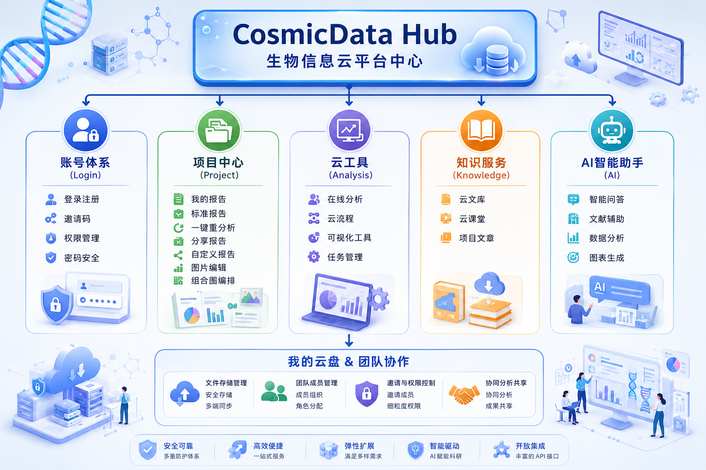

# CosmicData Hub 生物信息云平台介绍

  

    <strong>图：</strong>CosmicData Hub 生物信息云平台功能总览
  

## 平台概述

**CosmicData Hub 生物信息云平台**是一款面向科研机构、医院、高校及生物医药企业打造的一站式科研数据分析与协作平台。平台围绕生命科学研究中的数据管理、项目协作、在线分析、报告交付、知识学习与智能辅助等核心场景，构建了覆盖科研数据全流程的数字化服务体系。

平台集项目管理、标准报告交付、在线云工具、生信流程重分析、自定义报告编辑、科研绘图编排、团队协作、知识服务以及 AI 智能助手于一体，帮助用户实现从数据管理、分析计算到结果解读和成果产出的全流程闭环。

## 平台定位

CosmicData Hub 致力于打造智能化、协同化、可追溯的科研基础设施。用户无需复杂编程基础，即可通过平台完成常见生物信息分析、结果查看、图表优化、报告管理与科研资料沉淀，从而降低生信分析使用门槛，提升科研工作效率。

平台不仅面向专业生信分析人员，也适用于课题组成员、临床科研人员、项目管理人员及成果交付人员等多类角色，为多部门、多项目、多任务的科研协作提供统一入口。

## 核心功能体系

### 账号体系

平台提供登录注册、邀请码、权限管理和密码安全能力，支持用户按项目、团队或组织关系进行账号使用和访问控制，保障科研数据与项目资料的安全管理。

### 项目中心

项目中心用于承载用户的报告、分析任务和项目成果。用户可在平台中查看我的报告、标准报告和共享报告，并可进行自定义报告编辑、图片编辑和组合图编排，满足科研成果整理、交付和复用需求。

### 云工具

云工具模块面向在线分析和结果再加工场景，支持用户通过云端分析工具、云流程、可视化工具和任务管理能力完成数据分析、二次分析和结果优化。用户无需在本地部署复杂环境，即可进行高效、便捷的科研分析操作。

### 知识服务

平台提供云文库、云课堂和项目文章等知识服务入口，帮助用户沉淀产品文档、培训课程、项目资料和科研文章资源。新用户可通过云课堂快速熟悉平台操作，项目成员也可通过知识服务持续获取分析说明、方法资料和研究参考。

### AI 智能助手

AI 智能助手面向科研问答、文献辅助、数据分析和图表生成等场景，帮助用户提升结果理解、资料检索和科研表达效率。通过 AI 能力与平台数据分析流程结合，CosmicData Hub 可进一步增强科研数据价值挖掘能力。

### 我的云盘与团队协作

平台支持文件存储管理、团队成员管理、邀请与权限控制、协同分析共享等能力。用户可在团队空间中进行资料共享、成员分组、角色分配和成果共享，提升课题组、项目组及交付团队之间的协作效率。

## 平台优势

- **安全可靠**：通过账号体系、权限控制和数据安全机制，保障项目资料和科研数据安全。
- **高效便捷**：提供一站式云端分析与报告管理能力，减少本地环境配置和重复操作成本。
- **弹性扩展**：支持多类分析工具、项目资料和团队协作场景，适配不同科研项目需求。
- **智能驱动**：融合 AI 智能助手能力，辅助科研问答、文献处理、数据分析和图表生成。
- **开放集成**：具备持续扩展的工具服务和接口能力，便于后续接入更多科研分析流程。

## 适用场景

- 科研项目的数据分析、报告查看和成果交付。
- 医院、高校、科研机构的生物信息分析平台化建设。
- 生物医药企业的多项目数据管理与分析协作。
- 课题组内部的资料沉淀、成员协同和知识培训。
- 非编程用户对生信分析、可视化图表和报告编辑的在线使用需求。

## 访问方式

平台访问地址：[https://cosmicdatahub.cwmda.com:9000/#/home](https://cosmicdatahub.cwmda.com:9000/#/home)

## 云平台操作说明文档

如需查看详细的平台功能操作步骤，请点击下方链接打开操作说明文档：

<a href="./CosmicData_Hub.src/CosmicData_Hub_User_Guide.pdf" target="_blank" rel="noopener noreferrer">打开 CosmicData Hub 生物信息云平台操作说明书</a>
